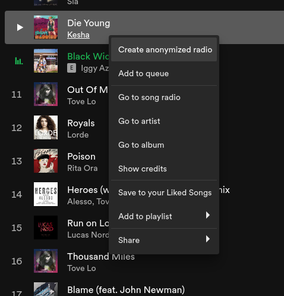
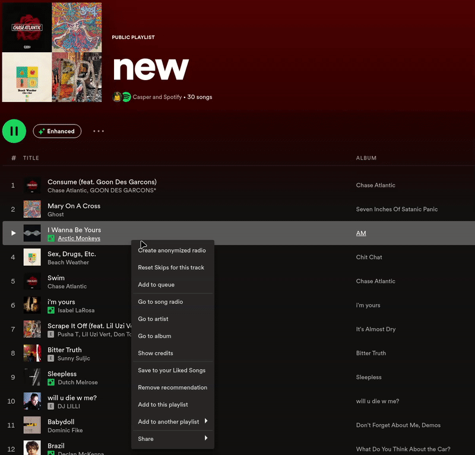

# AnonymizedRadios
<a href="https://www.buymeacoffee.com/caspr" target="_blank"></a>

Spotify heavily personalizes song radios based on the music you listen to. However, sometimes you want to listen to something fresh.

This extension solves that problem. To use it, simply right-click a song and click "Create anonymized radio." You will then be redirected to an anonymized song radio that is based on the song you selected, but does not take your listening history into account.

The only way this extension works is thanks to [Spoqify](https://spoqify.com/), please star their Github repo if you want to!

<p float="middle">
  
   
</p>

## Install
You can either use the [Marketplace](https://github.com/spicetify/spicetify-marketplace/wiki/Installation) to install it, or:

Copy the `.js` file into your [Spicetify](https://github.com/spicetify/spicetify-cli) extensions directory:
| **Platform** | **Path**                                                                            |
|------------|-----------------------------------------------------------------------------------|
| **Linux**      | `~/.config/spicetify/Extensions` or `$XDG_CONFIG_HOME/.config/spicetify/Extensions/` |
| **MacOS**      | `~/spicetify_data/Extensions` or `$SPICETIFY_CONFIG/Extensions`                      |
| **Windows**    | `%appdata%\spicetify\Extensions\`                                              |

After putting the extension file into the correct folder, run the following command to install the extension:
```
spicetify config extensions AnonymizedRadios.js
spicetify apply
```
